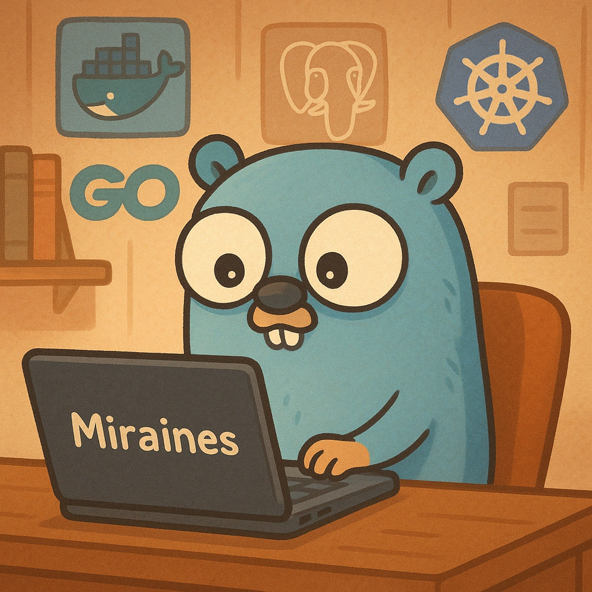

<!-- Пример README.md для GitHub-профиля -->

<!-- Заголовок и приветствие -->
<h1 align="center">
  Приветствую всех! 
</h1>

---

### *Обо мне*
Меня зовут **Сабия Александр**, мне 20 лет, и я обучаюсь на втором курсе ITMO University.  
Занимаюсь разработкой высоконагруженных систем на **Go** и стремлюсь к непрерывному развитию в сфере IT. 

- **Github** [Miraines](https://github.com/Miraines)  
- **Telegram:** [@Maustenok](https://t.me/Maustenok)  
- **Email:** [sasha_sabiya@list.ru](mailto:sasha_sabiya@list.ru)

---

### *Технологии и инструменты:*

  <!-- Go -->
  
  <!-- PostgreSQL -->
  
  <!-- Docker -->
  
  <!-- Kubernetes -->
  
  <!-- Kafka -->
  
  <!-- Redis -->
  
  <!-- NATS -->
  
  <!-- Grafana -->
  
  <!-- RESTful API -->
  
  <!-- .NET -->
  
  <!-- Git -->
  
  <!-- Github -->
  

---

<!-- Статистика GitHub (виджеты) -->
## Статистика GitHub

  <!-- Общая статистика (замените Miraines на свой ник, если нужно) -->
  
  <!-- Наиболее часто используемые языки (замените Miraines на свой ник, если нужно) -->
  

<!-- Трофеи (опционально, если хотите) -->

  

---

<h3 align="center">Связаться со мной</h3>

  
  

